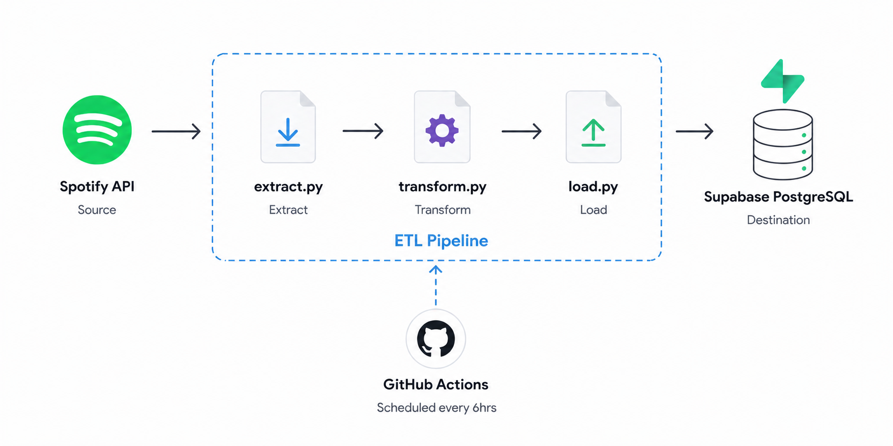

# 🎵 Spotify Listening History Pipeline 🎵
## Overview
I set out to build an automated ETL pipeline that extracts my recently played tracks from the Spotify API, transforms the raw JSON response into a structured format, and loads it into a PostgreSQL database hosted on Supabase.

The pipeline runs automatically every 6 hours via GitHub Actions, gradually building a personal dataset of my listening history that can later be used to analyse my own music habits, rather than relying on generic datasets.

## Architecture


## Tech Stack
-	Python
-	Spotipy
-	psycopg2
-	PostgreSQL
-	Supabase
-	GitHub Actions

## Features
-	Automated scheduling
- Deduplication — tracks already in the database are automatically skipped on each run
- Incremental loading — only new tracks are inserted, rather than reloading all data each time
-	Cloud hosted PostgreSQL database

## Project Structure
```
spotify-pipeline/
│
├── .github/
│   └── workflows/
│       └── pipeline.yml
│
├── ingestion/
│   └── extract.py
│
├── transformation/
│   └── transform.py
│
├── loading/
│   └── load.py
│
├── database/
│   └── schema.sql
│
├── main.py
├── requirements.txt
├── .env
├── .gitignore
└── README.md
```

## Setup & Installation
1. Clone this repository.
2. Create and activate a virtual environment with `python -m venv venv` and `source venv/bin/activate`.
3. Install the necessary Python packages with `pip install -r requirements.txt`.
4. Add your database credentials and Spotify API client secrets in the `.env` file.

## Environment Variables
Create a `.env` file in the root directory with the following variables:

-	`SPOTIFY_CLIENT_ID=`
-	`SPOTIFY_CLIENT_SECRET=`
-	`SPOTIFY_REDIRECT_URI=`
-	`SPOTIFY_REFRESH_TOKEN=`
-	`DB_NAME=`
-	`DB_USER=`
-	`DB_PASSWORD=`
-	`DB_HOST=`
-	`DB_PORT=`

## How It Works
### Extract
```python
# use refresh token to get a new access token without browser login 
token_info = auth_manager.refresh_access_token(spotify_refresh_token)
sp = spotipy.Spotify(auth=token_info['access_token'])
```
The Spotify API uses OAuth 2.0 for authentication. In a standard flow this requires a browser login, which isn't possible in an automated pipeline. To get around this, I stored a refresh token as a GitHub Secret and used it to programmatically obtain a fresh access token on each run, allowing the pipeline to authenticate without any manual intervention.

### Transform
```python
# artists is a list of objects — join multiple artists into one comma separated string
artist = ', '.join([artist['name'] for artist in item['track']['artists']])
```
The raw API response returns artists as a list of objects rather than a simple string, since a track can have multiple artists. I looped through each artist object to extract the name, then joined them into a single comma-separated string suitable for database storage.


### Load
```sql
INSERT INTO recently_played_tracks (track_id, track_name, artist, album, duration_s, played_at)
VALUES (%s, %s, %s, %s, %s, %s)
ON CONFLICT (played_at) DO NOTHING
```
Since the pipeline runs every 6 hours and the Spotify API returns the last 50 tracks, there will always be overlap between runs. I handled deduplication at the database level using `ON CONFLICT (played_at) DO NOTHING`, so if a track with that timestamp already exists, the insert is silently skipped. This makes the pipeline idempotent.

```python
print(f"{attempts_count} row(s) attempted, {inserted_rows} row(s) inserted, {attempts_count-inserted_rows} row(s) skipped")
```
I also added logging to each run to summarise how many rows were attempted, inserted, and skipped, making it easy to monitor pipeline behaviour and verify that deduplication is working correctly across runs.

## Scheduling & Automation
While I initially considered using Airflow for orchestration, it felt like overkill for the scope and scale of this pipeline, since Airflow is better suited to larger, more complex workflows with many interdependent tasks.

Instead I opted for GitHub Actions, which runs the pipeline automatically every 6 hours (00:00, 06:00, 12:00, 18:00 UTC). Spotify API credentials and Supabase database secrets are stored as GitHub Secrets and passed into the pipeline at runtime via `pipeline.yml`, keeping sensitive credentials out of the codebase entirely.

A `workflow_dispatch` trigger was also added to allow manual runs for testing purposes.

## Database Schema
| Column     | Type                     | Description                                                       |
|------------|--------------------------|-------------------------------------------------------------------|
| id         | SERIAL PRIMARY KEY       | Auto-generated unique row identifier                              |
| track_id   | VARCHAR(50)              | Spotify's unique track identifier                                 |
| track_name | TEXT                     | Name of the track                                                 | 
| artist     | TEXT                     | Artist name(s), multiple artists joined as comma-separated string | 
| album      | TEXT                     | Album name                                                        | 
| duration_s | INTEGER                  | Track duration in seconds (converted from milliseconds)           |
| played_at  | TIMESTAMP WITH TIME ZONE | Timestamp of when the track was played (unique)                   |

## Key Concepts Demonstrated
- **ETL Pattern** — the pipeline is structured around three distinct layers: extract, transform, and load. Each layer has a single responsibility, making the codebase easier to debug, extend, and understand.
- **Incremental Loading** — rather than reloading all data on every run, only new tracks are inserted into the database, making the pipeline more efficient over time.
- **Deduplication** — `ON CONFLICT (played_at) DO NOTHING` ensures that if the pipeline runs twice in the same window, no duplicate records are created.
- **Idempotency** — the pipeline can be run multiple times without producing incorrect or duplicate results.
- **OAuth 2.0 Authentication** — I used a refresh token to authenticate with the Spotify API programmatically, without requiring a browser login on each run.
- **Environment Variables** — all sensitive credentials are stored in a `.env` file locally and as GitHub Secrets in production, keeping them out of the codebase entirely.

## What I Learned
Building this project gave me a much deeper understanding of what data engineering actually involves in practice. I came in thinking the hardest part would be cleaning and transforming messy data, but with API data the real challenge is around structure. Flattening nested JSON, making deliberate decisions about column types and schema design, and thinking carefully about what happens when the pipeline runs more than once were all things I hadn't fully anticipated going in.

I also learned how to separate concerns properly across a codebase. As someone coming from a software development background this felt familiar in theory, but applying it in a data context was a different experience. Keeping each layer of the pipeline in its own module made the project much easier to debug and reason about.

Getting GitHub Actions set up and running was probably the most satisfying part of the build. Seeing the pipeline execute automatically in the cloud, with a green tick and real data landing in Supabase, made the whole project feel complete in a way that just running a script locally never does.

## Future Improvements
- Build a dashboard to visualise my listening patterns using the data the pipeline has been collecting, showing things like my most played artists, listening trends over time, and what time of day I listen most
- Write SQL analysis queries against the database to find interesting patterns in my own listening habits, such as my most played artists, how much time I spend listening per day, and which hours I listen most
- Explore dbt as a transformation tool, which would allow me to structure my data into cleaner, more organised layers rather than handling all transformations in raw Python scripts. This is something I plan to pick up in my next project
- Look into pagination to handle days where I listen to more than 50 tracks, since the Spotify API caps each request at 50 results and I could miss plays on heavy listening days
