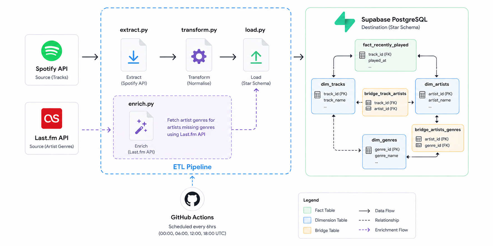
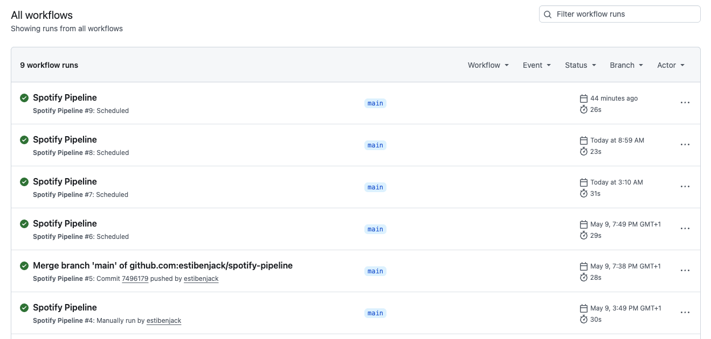

# 🎵 Spotify Listening History Pipeline 🎵
## Overview
I set out to build an automated ETL pipeline that extracts my recently played tracks from the Spotify API, transforms the raw JSON response into a structured format, and loads it into a PostgreSQL database hosted on Supabase.

The pipeline runs automatically every 6 hours via GitHub Actions, gradually building a personal dataset of my listening history that can later be used to analyse my own music habits, rather than relying on generic datasets.

Since the initial build, I've refactored the pipeline to support a normalised Star Schema, separating artists, tracks and plays into distinct tables with a bridge table to handle tracks with multiple artists. I also added an enrichment stage using the Last.fm API to fetch artist genres, filling a gap left by Spotify's deprecated genre field.

## Architecture


## Tech Stack
-	Python
-	Spotipy
-	psycopg2
-	Pandas
- SQLAlchemy
-	Requests
-	PostgreSQL
-	Supabase
-	GitHub Actions

## Features
-	Automated scheduling
- Deduplication — tracks already in the database are automatically skipped on each run
- Incremental loading — only new tracks are inserted, rather than reloading all data each time
-	Cloud hosted PostgreSQL database

## Project Structure
```
spotify-pipeline/
│
├── .github/
│   └── workflows/
│       └── pipeline.yml
│
├── database/
│   ├── schema.sql
│   └── refactor_schema.sql
│
├── ingestion/
│   ├── extract.py
│   └── enrich.py
│
├── loading/
│   └── load.py
│
├── migration/
│   └── migrate_existing_data.py
│
├── queries/
│
├── transformation/
│   └── transform.py
│
├── main.py
├── requirements.txt
├── .env
├── .gitignore
└── README.md
```

## Setup & Installation
1. Clone this repository.
2. Create and activate a virtual environment with `python -m venv venv` and `source venv/bin/activate`.
3. Install the necessary Python packages with `pip install -r requirements.txt`.
4. Add your database credentials, and Spotify API and Last.fm API client secrets in the `.env` file.

## Environment Variables
Create a `.env` file in the root directory with the following variables:

-	`SPOTIFY_CLIENT_ID=`
-	`SPOTIFY_CLIENT_SECRET=`
-	`SPOTIFY_REDIRECT_URI=`
-	`SPOTIFY_REFRESH_TOKEN=`
-	`DB_NAME=`
-	`DB_USER=`
-	`DB_PASSWORD=`
-	`DB_HOST=`
-	`DB_PORT=`
-	`LASTFM_API_KEY=`
-	`LASTFM_API_SECRET=`

## How It Works
### Extract (Spotify API)
```python
# use refresh token to get a new access token without browser login 
token_info = auth_manager.refresh_access_token(spotify_refresh_token)
sp = spotipy.Spotify(auth=token_info['access_token'])
```
The Spotify API uses OAuth 2.0 for authentication. In a standard flow this requires a browser login, which isn't possible in an automated pipeline. To get around this, I stored a refresh token as a GitHub Secret and used it to programmatically obtain a fresh access token on each run, allowing the pipeline to authenticate without any manual intervention.

### Transform
```python
transformed_data = {
    'artists': [{'artist_id': a['id'], 'artist_name': a['name']} for a in track['artists']],
    'tracks': [{'track_id': track['id'], 'track_name': track['name']}],
    'plays': [{'track_id': track['id'], 'played_at': item['played_at']}]
}
```
Originally, I was joining multiple artists into a single comma-separated string, which worked but wasn't great for querying. I refactored this into a proper normalised structure, splitting the data into separate lists for artists, tracks and plays. Artists now have their own table, and a bridge table handles the many-to-many relationship between tracks and artists.

### Load
```python
for artist in transformed_data['artists']:
    cur.execute("INSERT INTO dim_artists ... ON CONFLICT (artist_id) DO NOTHING")
```
With the data now split across multiple tables, the load order matters. Dimension tables go in first to satisfy foreign key constraints, then the bridge and fact tables. `ON CONFLICT DO NOTHING` keeps things idempotent throughout. If the pipeline runs twice in the same window, nothing breaks and nothing duplicates.

### Enrichment (Last.fm API)
```python
response = requests.get(base_url, params=params, verify=False)
tags = data['artist']['tags']['tag']
```
Spotify quietly removed genre data from their artist API response, which left a pretty obvious gap in the dataset. To fill it, I added an enrichment stage that finds artists in the database who are missing genres and fetches crowdsourced tags from the Last.fm API as a substitute. I also had to implement a custom SSL bypass to keep the enrichment running reliably across both local and GitHub Actions environments.

## Scheduling & Automation
While I initially considered using Airflow for orchestration, it felt like overkill for the scope and scale of this pipeline, since Airflow is better suited to larger, more complex workflows with many interdependent tasks.

Instead I opted for GitHub Actions, which runs the pipeline automatically every 6 hours (00:00, 06:00, 12:00, 18:00 UTC). Spotify API credentials and Supabase database secrets are stored as GitHub Secrets and passed into the pipeline at runtime via `pipeline.yml`, keeping sensitive credentials out of the codebase entirely.

A `workflow_dispatch` trigger was also added to allow manual runs for testing purposes.

### Pipeline Runs


## Database Schema
### The original schema 💀❌
| Column     | Type                     | Description                                                       |
|------------|--------------------------|-------------------------------------------------------------------|
| id         | SERIAL PRIMARY KEY       | Auto-generated unique row identifier                              |
| track_id   | VARCHAR(50)              | Spotify's unique track identifier                                 |
| track_name | TEXT                     | Name of the track                                                 | 
| artist     | TEXT                     | Artist name(s), multiple artists joined as comma-separated string | 
| album      | TEXT                     | Album name                                                        | 
| duration_s | INTEGER                  | Track duration in seconds (converted from milliseconds)           |
| played_at  | TIMESTAMP WITH TIME ZONE | Timestamp of when the track was played (unique)                   |

### The new shiny schema ✅✨
The database now uses a star schema to minimise redundancy and allow for more complex analysis of listening habits over time. 

The benefit of this new structure is that it allows me to query my top genres by joining the fact table through the artist bridge to the genre dimension or have reliable top artist info (since the concatenated strings were counting multiple artists on a track as a unique artist) — which just wasn't possible with the original flat-file design.

**Fact table: `fact_recently_played`**

Stores the individual Listening events.

| Column     | Type                     | Description                                      |
|------------|--------------------------|--------------------------------------------------|
| play_id    | SERIAL PRIMARY KEY       | Unique identifier for the play event             |
| track_id   | VARCHAR(50)              | FK: References `dim_tracks`                      |
| played_at  | TIMESTAMP                | Unique timestamp of the play (deduplication key) |

**Dimension Tables**
| Table | Column | Type | Description |
|---|---|---|---|
| **dim_tracks** | track_id | VARCHAR(50) PRIMARY KEY | Spotify's unique track identifier |
|  | track_name | TEXT | Name of the track |
|  | album_name | TEXT | Album title |
|  | duration_ms | INTEGER | Duration in milliseconds |
| **dim_artists** | artist_id | VARCHAR(50) PRIMARY KEY | Spotify's unique artist identifier |
|  | artist_name | TEXT | Name of the artist |
| **dim_genres** | genre_id | SERIAL PRIMARY KEY | Unique identifier for a genre |
|  | genre_name | VARCHAR(100) | Crowdsourced tag from Last.fm |


**Bridge Tables (Many-to-Many Relationships)**
Since a track can have multiple artists, and an artist can belong to multiple genres, I used bridge tables to maintain relational integrity.
- `bridge_track_artists`: Maps `track_id` to `artist_id`
- `bridge_artist_genres`: Maps `artist_id` to `genre_id`


## Key Concepts Demonstrated
- **ETL Pattern** — the pipeline is structured around three distinct layers: extract, transform, and load. Each layer has a single responsibility, making the codebase easier to debug, extend, and understand.
- **Normalised Star Schema** - after an initial refactor, the data is now split across dimension, fact and bridge tables rather than a single flat table. This makes the data much more queryable and reflects how real warehouse schemas are designed.
- **Incremental Loading** — rather than reloading all data on every run, only new tracks are inserted into the database, making the pipeline more efficient over time.
- **Deduplication** — `ON CONFLICT (played_at) DO NOTHING` is used across all inserts to ensure the pipeline never creates duplicate records, regardless of how many times it runs.
- **Idempotency** — the pipeline can be run multiple times without producing incorrect or duplicate results.
- **OAuth 2.0 Authentication** — I used a refresh token to authenticate with the Spotify API programmatically, without requiring a browser login on each run.
- **API Enrichment** - an additional enrichment stage fetches artist genre data from the Last.fm API to fill gaps left by Spotify's API, showing how multiple data sources can be combined in a single pipeline.
- **Environment Variables** — all sensitive credentials are stored in a `.env` file locally and as GitHub Secrets in production, keeping them out of the codebase entirely.

## What I Learned
Building this project gave me a much deeper understanding of what data engineering actually involves in practice. I came in thinking the hardest part would be cleaning and transforming messy data, but with API data the real challenge is around structure. Flattening nested JSON, making deliberate decisions about column types and schema design, and thinking carefully about what happens when the pipeline runs more than once were all things I hadn't fully anticipated going in.

I also learned how to separate concerns properly across a codebase. As someone coming from a software development background this felt familiar in theory, but applying it in a data context was a different experience. Keeping each layer of the pipeline in its own module made the project much easier to debug and reason about.

Getting GitHub Actions set up and running was probably the most satisfying part of the build. Seeing the pipeline execute automatically in the cloud, with a green tick and real data landing in Supabase, made the whole project feel complete in a way that just running a script locally never does.

## Future Improvements
- Build a dashboard to visualise my listening patterns using the data the pipeline has been collecting, showing things like my most played artists, listening trends over time, and what time of day I listen most
- Write SQL analysis queries against the database to find interesting patterns in my own listening habits, such as my most played artists, how much time I spend listening per day, and which hours I listen most
- Explore dbt as a transformation tool, which would allow me to structure my data into cleaner, more organised layers rather than handling all transformations in raw Python scripts. This is something I plan to pick up in my next project
- Look into pagination to handle days where I listen to more than 50 tracks, since the Spotify API caps each request at 50 results and I could miss plays on heavy listening days
